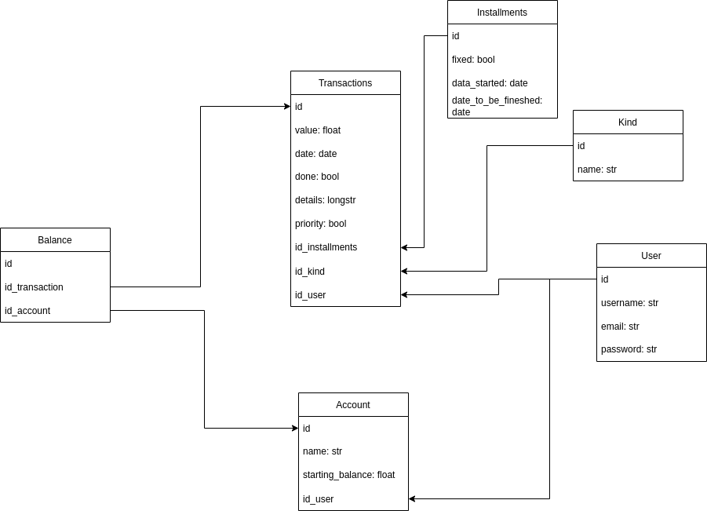

# My Budget API

An API to help people to keep track of their finances and budgets.

## Basics

The overall infraestructure and architecture of the solution and some other
useful informations.

### The database structure

Above are the tables and all the connections between those so it can be easy to
understand what is going on. The main table there is the transaction table,
there will be stored the actual transaction, with its value, user that did it,
and so on.

There also has balance table, which connects the account with the transaction,
to know the total amount of some account, it must calculate all the transactions
that happened on that account until some date in time.

### The Project Architecture

Working on it...
